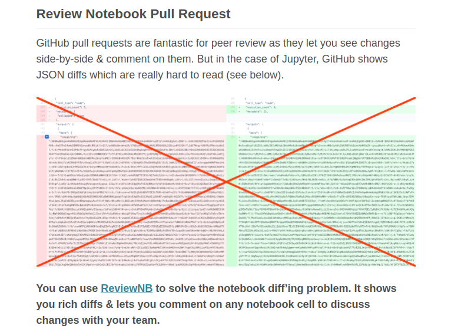

## Tutorial, Take home lab instructions (1.5%):


Classic Problem for Python Notebook development:




This is what the GitHistory of a large socially coded project can look like:


Its an acyclic directed graph, and the styling for visualizing part of the graph where different versions of the code are merged together is called "a tube of London" graph.


## Resistance Safe Houses (cafe reviews, or nature park reviews).

Collaboration using Gitub and geojson

## Step 1: Fork this!

There are two methods to contributing on GitHub. The first and most direct is for the owner to grant push access to you. This allows you to clone their repository directly and push changes without requiring their approval. Very convenient, but also a security nightmare and a real hassle to add and remove people from the list.


## Step  2: Adding content in geojson format

Create a new geojson file:

* Go to geojson.io and use the marker icon to place a marker at the Safehouse (cafe / bar) of your choice. This creates a Feature Collection with a geometry type Point...


* Add a short review of your safehouse. In particular add:
  * Name: Cafe name
  * Address: Cafe address
  * Review: quick review or star rating
  * Contributor: your name


* Copy the geojson text displayed in geojson.io

```
{
  "type": "FeatureCollection",
  "features": [
    {
      "type": "Feature",
      "properties": {
        "marker-color": "#7e7e7e",
        "marker-size": "medium",
        "marker-symbol": "",
        "name": "Tsubu Bar",
        "Address": "gate 6, swanston st, building 1888 university of Melbourne 3010"
      },
      "geometry": {
        "type": "Point",
        "coordinates": [
          144.96211051940918,
          -37.79845872037568
        ]
      }
    }
  ]
}

```


## Step  3:

Start a new file in github, using the `newfile` button. You will need to do this in __Your Fork__. Make sure you:

* create this file in the `geojsons` directory (by clicking on that directory)
* name this file with the .geojson extension

Once you have created the file, paste in the contents of your geojson

## Step  4: Create a pull request

Time to create a pull request! In the main page of your `resistance-safe-houses` repository, click the `new pull request` button.

## Step  5: Merging pull requests

The owner of the repository will now 'merge' in the pull requests (after carefully reviewing the quality of each safehouse). Then `pull` the changes back to a local version of the repository on her computer.

## Step  6: Python Script merge the geojsons

In the local repository, the owner can now run`python merge_jsons.py` will merge the new files (merge all *.json files in the geojsons directory)

Don't forget to push these changes back to github..

## Step  7: Pull the upstream changes into your Fork

Run the following commands from the directory where you want to store a local copy of your repository.

First, make a local copy of the repository using `git clone`


Note USERNAME must reflect your github username in command below:
```
git clone https://github.com/USERNAME/resistance-safe-houses
cd resistance-safe-houses
```
There is one more thing left to do: keeping up to date with upstream. In Git upstream refers to some remote repository that you consider higher or more authoritative than yours. At the moment your local repository has one upstream repository, your GitHub repository. When you type git pull, that’s where it pulls from

```
git remote add upstream https://github.com/USERNAME/resistance-safe-houses.git
git fetch upstream
git merge upstream/master
git push
```
Push the merge to back to __your__ GitHub repository.

```
git push origin master
```

## Step  8: view the results

We embed the geojson into a gh-pages (project) web page here: http://fun-zoological-computing.github.io/resistance-safe-houses/

# Notes

## Acknowledgements

The idea came from dansand who taught this at the UoM research bazaar a long time ago.

http://dansand.github.io/resistance-safe-houses/

Dan Sand got the idea from Open Tech School:

http://opentechschool.github.io/social-coding/core/underground.html

##Rendering in github

 * Jupyter/IPython notebook (.ipynb) files will render directly on GitHub. GitHub encourage the adoption of the Jupyter notebook as a standard file format across a wide range of fields. Jupyter notebook files are a JSON-based open document format that supports code and results, narrative text, images, and equations in one file.

 * Any .geojson file in a GitHub repository will now be automatically rendered as an interactive, browsable map, annotated with your geodata.

 * images - png, etc

 * pdf

 * 3D (STL) File Viewing

## Project pages in github

## Geojson format

GeoJSON is a format for encoding a variety of geographic data structures.


The JSON format expects the keys to a dictionary to be strings. If you have other types as keys in your dictionary, trying to encode the object will produce a ValueError. One way to work around that limitation is to skip over non-string keys using the skipkeys argument:
